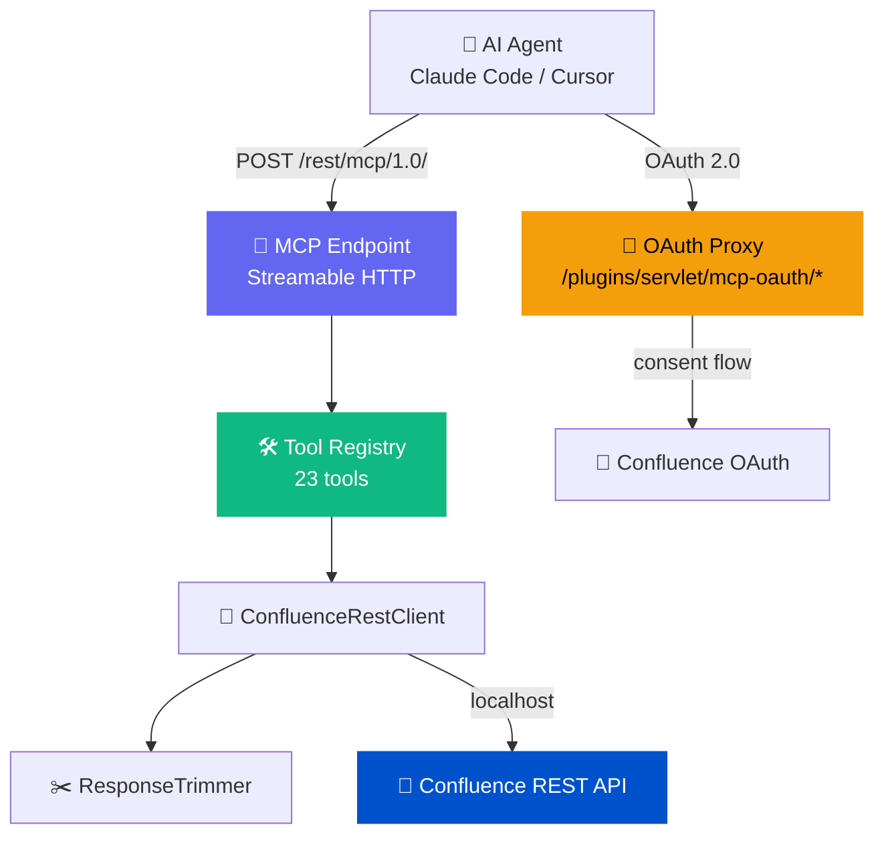
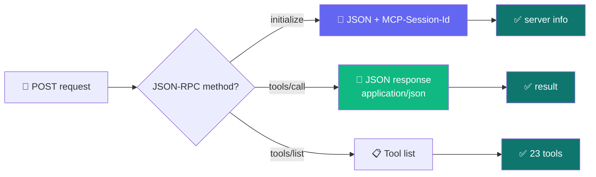
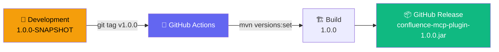

# 🔌 Confluence MCP Plugin

> 🏢 Native MCP server for Confluence Data Center. AI agents connect directly to your Confluence instance.
>
> Repository: `confluence-mcp-plugin`

[](https://github.com/mrkhachaturov/confluence-mcp-plugin/actions/workflows/build.yml)
[](LICENSE)


[MCP](https://modelcontextprotocol.io/) (Model Context Protocol) server that runs inside your Confluence Data Center JVM. Claude Code, Cursor, and other MCP-compatible tools connect to it and work with pages, spaces, comments, labels, attachments, and more. Everything stays inside your infrastructure.

| | Scope | Meaning |
|---|-------|---------|
| 🔌 | Plugin | Single JAR, installed via UPM, runs inside the Confluence JVM |
| 🔐 | Auth | OAuth 2.0 (browser consent) + Personal Access Tokens |
| 🛠️ | Tools | 23 tools mirrored 1:1 from [mcp-atlassian](https://github.com/sooperset/mcp-atlassian) upstream |
| 📡 | Transport | Streamable HTTP (MCP spec 2025-06-18) with SSE streaming |

> [!IMPORTANT]
> This plugin runs entirely inside Confluence. No data leaves your infrastructure.
> No sidecars, no proxies, no external API calls. The plugin talks to Confluence's own REST API on localhost.

---

## 🗺️ How it works



---

## ⚡ Quick start

```bash
# 1️⃣  Install: download JAR from Releases, upload via UPM
#     Confluence Admin > Manage Apps > Upload App

# 2️⃣  Configure OAuth (recommended)
#     Confluence Admin > Application Links > Create Link > External Application
#     Name: MCP Server
#     Redirect URL: https://your-confluence/plugins/servlet/mcp-oauth/callback
#     Permission: Write
#     Then: MCP Configuration > OAuth tab > paste Client ID and Secret

# 3️⃣  Connect your AI tool
```

```json
{
  "mcpServers": {
    "confluence": {
      "type": "http",
      "url": "https://your-confluence.example.com/rest/mcp/1.0/"
    }
  }
}
```

On first connection, click Authenticate, consent on the Confluence page, and you're in.

---

## 🛠️ Available tools

<details>
<summary>23 tools across 6 categories (click to expand)</summary>

| | Category | Tools | Count |
|---|----------|-------|:-----:|
| 📄 | Pages | `search`, `get_page`, `get_page_children`, `create_page`, `update_page`, `delete_page`, `move_page`, `get_page_history`, `get_page_diff` | 9 |
| 💬 | Comments | `get_comments`, `add_comment`, `reply_to_comment` | 3 |
| 🏷️ | Labels | `get_labels`, `add_label` | 2 |
| 📎 | Attachments | `get_attachments`, `upload_attachment`, `upload_attachments`, `download_attachment`, `download_content_attachments`, `delete_attachment`, `get_page_images` | 7 |
| 👤 | Users | `search_user` | 1 |
| 📊 | Analytics | `get_page_views` (Cloud-only) | 1 |

</details>

---

## 📡 Transport

The plugin implements MCP Streamable HTTP on a single endpoint. The server decides the response format per request.



| | Method | Behavior |
|---|--------|----------|
| 📨 | POST | JSON-RPC request → JSON response |
| 📡 | GET | SSE stream for server-initiated notifications (requires `MCP-Session-Id`) |
| 🗑️ | DELETE | Close session |

Sessions are tracked via the `MCP-Session-Id` header, assigned on `initialize`.

---

## 🔐 Authentication

### OAuth 2.0 (recommended) 🌐

The plugin proxies between MCP clients and Confluence's built-in OAuth provider. Users click Authenticate, consent in the browser, and the token exchange happens automatically.


### Personal Access Tokens 🔑

Create a PAT in Confluence (Profile > Personal Access Tokens) and configure your MCP client with a Bearer token header.

---

## 🛡️ Enterprise security

The plugin runs inside the Confluence JVM. No data leaves your infrastructure. It uses Confluence's own OAuth 2.0 and PAT mechanisms, so there are no separate credentials and no API keys to external services. The same Confluence permissions apply: users can only access spaces and pages they already have access to.

| | Concern | How it's handled |
|---|---------|-----------------|
| 🏠 | Data residency | Runs inside Confluence JVM, no outbound connections |
| 🔐 | Authentication | Confluence's own OAuth 2.0 and PATs |
| 🔒 | Authorization | Same Confluence permissions, same space access |
| 👥 | Admin control | Group and user allowlists, per-tool enable/disable, read-only mode |
| ⚡ | Rate limiting | IP-based (register 5/min, token 20/min, MCP 120/min) |
| 📏 | Body limits | 1MB for MCP, 64KB for register, 8KB for token |
| 🔑 | PKCE | S256 enforced on all OAuth flows |
| 🌐 | Origin validation | `Origin` header checked per MCP spec (DNS rebinding protection) |
| 📋 | Security logging | `[MCP-SEC]` prefix for incident response |
| 🔗 | Open redirect | `redirect_uri` validated against registered URIs |

> [!CAUTION]
> The plugin makes localhost HTTP calls to Confluence's own REST API. No outbound network connections are made. Verify this by checking your firewall logs after installation.

---

## ⚙️ Admin configuration

Access via Confluence Admin > MCP Server > MCP Configuration.

| | Tab | What |
|---|-----|------|
| ⚙️ | General | Enable/disable MCP, read-only mode, base URL override |
| 👥 | Access Control | Allowed groups + individual users (empty = everyone) |
| 🛠️ | Tools | Click-to-toggle tool list with search filter |
| 🔐 | OAuth | Client ID/Secret, status, callback URL, user config snippet |

---

## ✂️ Response trimming

Confluence's REST API returns verbose JSON that AI agents don't need. The plugin strips noise before returning results — **83% size reduction** (4.4KB → 750 bytes typical).

Fields stripped recursively: `self`, `_links`, `_expandable`, `expand`, `extensions`, `profilePicture`, `userKey`

Fields stripped at top level: `operations`, `restrictions`, `metadata`, `container`, `position`

Search highlight markers (`@@@hl@@@`, `@@@endhl@@@`) are also removed.

---

## 📋 Prerequisites

| | Tool | Purpose |
|---|------|---------|
| ☕ | Java 21 | Runtime (via mise) — Confluence 10.x requires it |
| 🧰 | Atlassian Plugin SDK | `atlas-mvn` for local builds |
| ⚡ | `just` | Task runner |
| 🔧 | `mise` | Tool version manager + env var loader |

## 🔨 Building from source

```bash
# 🧰 Setup
mise trust && mise install

# 🏗️ Build
just build

# 🚀 Build + deploy + run e2e tests
just deploy-and-test

# 📋 Or step by step
just deploy              # build + upload to Confluence UPM
just e2e                 # run e2e tests against live Confluence
just codegen             # regenerate tools from upstream Python definitions
```

---

## 🔄 Release process



Development uses `1.0.0-SNAPSHOT` in pom.xml. When you push a tag like `v1.0.0`, GitHub Actions strips the SNAPSHOT suffix and builds a clean release JAR. The CHANGELOG.md entry for that version is included in the release notes.

---

## 🙏 Credits

Tool definitions are mirrored from [mcp-atlassian](https://github.com/sooperset/mcp-atlassian) by [@sooperset](https://github.com/sooperset). That project is a Python-based MCP server for Atlassian products. This plugin re-implements the same 23 Confluence tools as a native plugin so you don't need an external process.

## 📄 License

[MIT](LICENSE)
